<!-- HEADER SECTION -->
<div align="center">
  <h1><code>┌── [marwane-faridi] ~/profile/root</code></h1>
  <p><strong>⚡ Software Engineer | Full-Stack &amp; Mobile Developer</strong></p>
</div>

<p align="center">
  
</p>

<!-- DYNAMIC DASHBOARD CARD -->
<p align="center">
  <a href="https://github.com/MarwanFo">
    
  </a>
</p>

<div align="center">
  <a href="https://www.linkedin.com/in/marwane-faridi-bb6076360"></a>
  <a href="mailto:itsmemarwanefo@gmail.com"></a>
</div>

<br />

<!-- ABOUT ME (TERMINAL BOX) -->
<table>
  <tr>
    <td>
      <pre>
<span><b>marwane@faridi:~$</b> cat about_me.md</span>
<br />
👋 Hi, I'm Marwane! I am a Software Engineer focused on building scalable web 
and mobile ecosystems. I specialize in bridging powerful backends with highly 
responsive, animated user interfaces.

• 🛠️ <b>Current Focus:</b> Designing robust APIs &amp; state-driven mobile apps.
• ⚡ <b>Key Architecture:</b> Developed high-performance APIs and role-based student portals.
• 🤖 <b>Hardware/Software:</b> Developed "DromAI" autonomous robot control scripts.
• 💼 <b>Status:</b> Actively seeking a Summer 2026 PFA Internship.

</pre>
    </td>
  </tr>
</table>

---

## 🛠️ Ecosystem &amp; Tech Stack

| Category | Technologies |
| :--- | :--- |
| **Languages** |       |
| **Frontend** |      |
| **Mobile** |   |
| **Backend** |     |
| **Databases** |     |
| **DevOps &amp; Tools** |      |

---

## 🚀 Key Highlights &amp; Projects

<!-- Grid layout for projects -->
<table border="0">
  <tr>
    <td width="50%" valign="top">
      <h3>🎓 SmartUpf V2</h3>
      <p>A comprehensive academic administration portal featuring role-based access control, custom security Voters, and high-performance API structures.</p>
      <code>Symfony</code> <code>React</code> <code>PostgreSQL</code>
    </td>
    <td width="50%" valign="top">
      <h3>🤖 DromAI (NURC 2026)</h3>
      <p>Co-developed an autonomous robotic camel, implementing custom control algorithms, sensor logic, and competition routing.</p>
      <code>Python</code> <code>Robotics Automation</code>
    </td>
  </tr>
  <tr>
    <td width="50%" valign="top">
      <h3>⚡ Enterprise Architectures</h3>
      <p>Building high-performance APIs and specialized backends with rigorous database indexing and query optimization.</p>
      <code>Spring Boot</code> <code>Laravel</code> <code>SQL Server</code>
    </td>
    <td width="50%" valign="top">
      <h3>📱 Mobile Applications</h3>
      <p>Developing native multi-platform experiences focusing on deep-linking, fluid navigations, and offline synchronization.</p>
      <code>React Native</code> <code>Expo</code>
    </td>
  </tr>
</table>

---

## 📈 System Metrics

<p align="center">
  
  
</p>

---

## 📨 `stdout` / Let's Connect

```bash
marwane@faridi:~$ curl -X POST https://api.marwane.dev/connect \
  -d "message=Let's collaborate on something great!"
```
